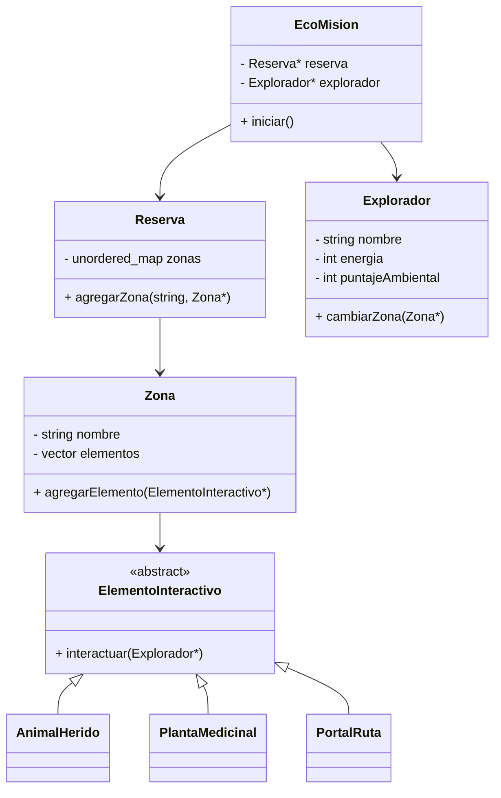
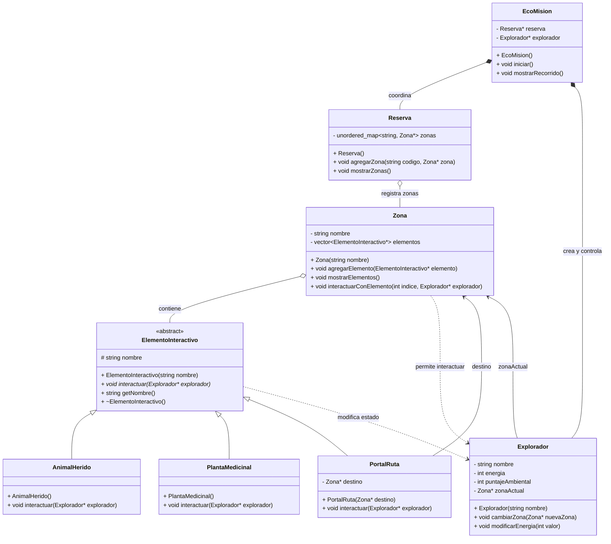
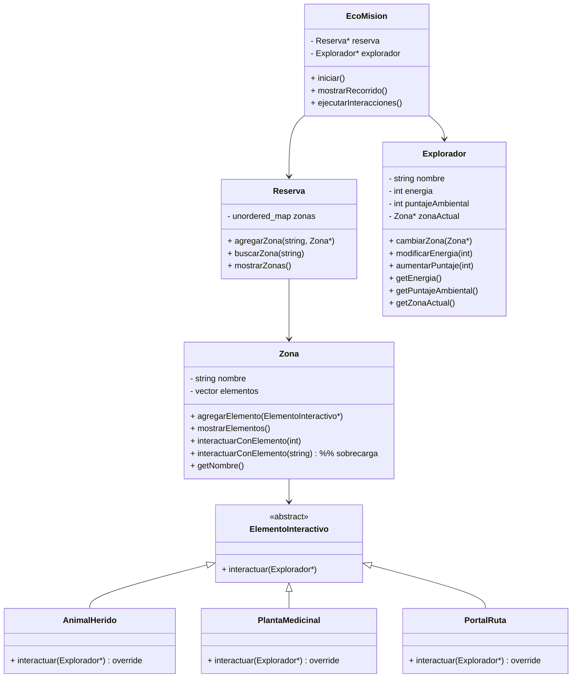

#Inicial

```mermaid
classDiagram 

    class EcoMision {
        - Reserva* reserva
        - Explorador* explorador
        + iniciar()
    }

    class Reserva {
        - unordered_map<string, Zona*> zonas
        + agregarZona(string, Zona*)
    }

    class Zona {
        - string nombre
        - vector<ElementoInteractivo*> elementos
        + agregarElemento(ElementoInteractivo*)
    }

    class Explorador {
        - string nombre
        - int energia
        - int puntajeAmbiental
        + cambiarZona(Zona*)
    }

    class ElementoInteractivo {
        <<abstract>>
        + interactuar(Explorador*)
    }

    ElementoInteractivo <|-- AnimalHerido
    ElementoInteractivo <|-- PlantaMedicinal
    ElementoInteractivo <|-- PortalRuta

    EcoMision --> Reserva
    EcoMision --> Explorador
    Reserva --> Zona
    Zona --> ElementoInteractivo
```

#Intermedio

```mermaid
classDiagram

    class EcoMision {
        - Reserva* reserva
        - Explorador* explorador
        + EcoMision()
        + void iniciar()
        + void mostrarRecorrido()
    }

    class Reserva {
        - unordered_map~string, Zona*~ zonas
        + Reserva()
        + void agregarZona(string codigo, Zona* zona)
        + void mostrarZonas()
    }

    class Zona {
        - string nombre
        - vector~ElementoInteractivo*~ elementos
        + Zona(string nombre)
        + void agregarElemento(ElementoInteractivo* elemento)
        + void mostrarElementos()
        + void interactuarConElemento(int indice, Explorador* explorador)
    }

    class Explorador {
        - string nombre
        - int energia
        - int puntajeAmbiental
        - Zona* zonaActual
        + Explorador(string nombre)
        + void cambiarZona(Zona* nuevaZona)
        + void modificarEnergia(int valor)
    }

    class ElementoInteractivo {
        <<abstract>>
        # string nombre
        + ElementoInteractivo(string nombre)
        + void interactuar(Explorador* explorador)*
        + string getNombre()
        + ~ElementoInteractivo()
    }

    class AnimalHerido {
        + AnimalHerido()
        + void interactuar(Explorador* explorador)
    }

    class PlantaMedicinal {
        + PlantaMedicinal()
        + void interactuar(Explorador* explorador)
    }

    class PortalRuta {
        - Zona* destino
        + PortalRuta(Zona* destino)
        + void interactuar(Explorador* explorador)
    }

    EcoMision *-- Reserva : coordina
    EcoMision *-- Explorador : crea y controla

    Reserva o-- Zona : registra zonas
    Zona o-- ElementoInteractivo : contiene

    Explorador --> Zona : zonaActual
    PortalRuta --> Zona : destino

    ElementoInteractivo <|-- AnimalHerido
    ElementoInteractivo <|-- PlantaMedicinal
    ElementoInteractivo <|-- PortalRuta

    ElementoInteractivo ..> Explorador : modifica estado
    Zona ..> Explorador : permite interactuar
```

#Final

```mermaid
classDiagram

    class EcoMision {
        - Reserva* reserva
        - Explorador* explorador
        + iniciar()
        + mostrarRecorrido()
        + ejecutarInteracciones()
    }

    class Reserva {
        - unordered_map<string, Zona*> zonas
        + agregarZona(string, Zona*)
        + buscarZona(string)
        + mostrarZonas()
    }

    class Zona {
        - string nombre
        - vector<ElementoInteractivo*> elementos
        + agregarElemento(ElementoInteractivo*)
        + mostrarElementos()
        + interactuarConElemento(int)
        + interactuarConElemento(string) %% sobrecarga
        + getNombre()
    }

    class Explorador {
        - string nombre
        - int energia
        - int puntajeAmbiental
        - Zona* zonaActual
        + cambiarZona(Zona*)
        + modificarEnergia(int)
        + aumentarPuntaje(int)
        + getEnergia()
        + getPuntajeAmbiental()
        + getZonaActual()
    }

    class ElementoInteractivo {
        <<abstract>>
        + interactuar(Explorador*)
    }

    class AnimalHerido {
        + interactuar(Explorador*) override
    }

    class PlantaMedicinal {
        + interactuar(Explorador*) override
    }

    class PortalRuta {
        + interactuar(Explorador*) override
    }

    EcoMision --> Reserva
    EcoMision --> Explorador
    Reserva --> Zona
    Zona --> ElementoInteractivo
    ElementoInteractivo <|-- AnimalHerido
    ElementoInteractivo <|-- PlantaMedicinal
    ElementoInteractivo <|-- PortalRuta
```
