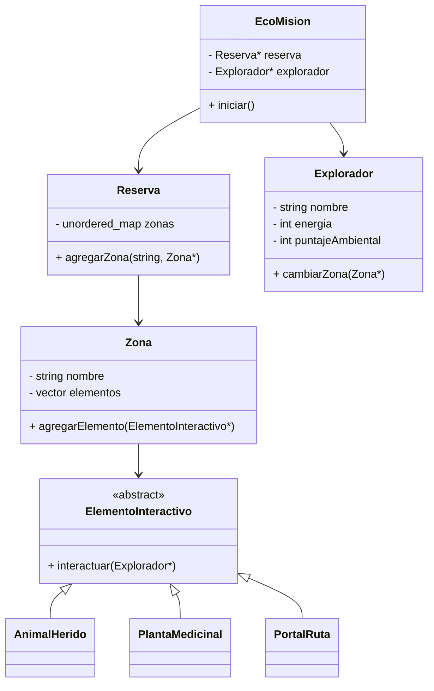
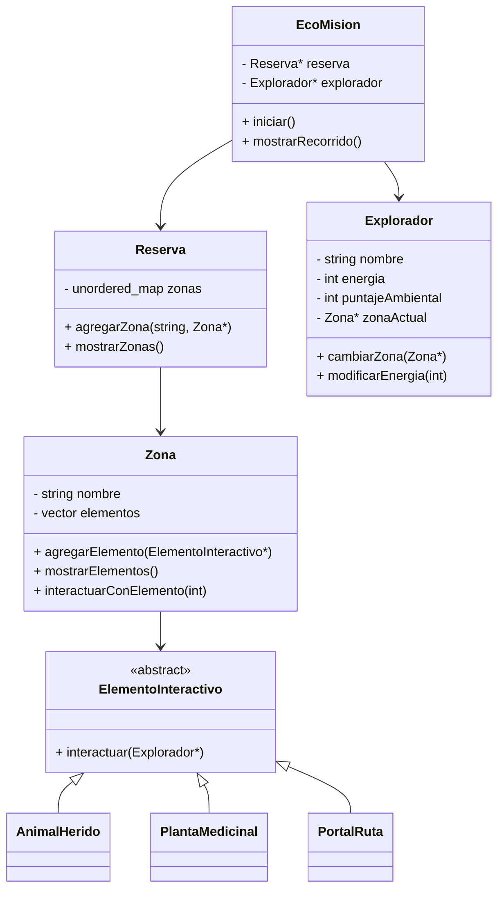
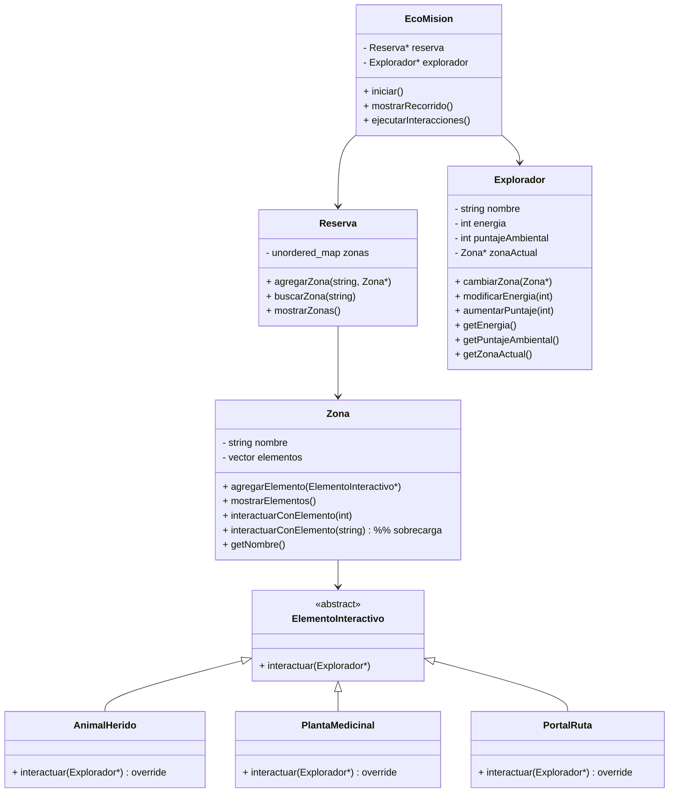

#Inicial

```mermaid
classDiagram 

    class EcoMision {
        - Reserva* reserva
        - Explorador* explorador
        + iniciar()
    }

    class Reserva {
        - unordered_map<string, Zona*> zonas
        + agregarZona(string, Zona*)
    }

    class Zona {
        - string nombre
        - vector<ElementoInteractivo*> elementos
        + agregarElemento(ElementoInteractivo*)
    }

    class Explorador {
        - string nombre
        - int energia
        - int puntajeAmbiental
        + cambiarZona(Zona*)
    }

    class ElementoInteractivo {
        <<abstract>>
        + interactuar(Explorador*)
    }

    ElementoInteractivo <|-- AnimalHerido
    ElementoInteractivo <|-- PlantaMedicinal
    ElementoInteractivo <|-- PortalRuta

    EcoMision --> Reserva
    EcoMision --> Explorador
    Reserva --> Zona
    Zona --> ElementoInteractivo
```

#Intermedio

```mermaid
classDiagram
    class EcoMision {
        - Reserva* reserva
        - Explorador* explorador
        + iniciar()
        + mostrarRecorrido()
    }

    class Reserva {
        - unordered_map<string, Zona*> zonas
        + agregarZona(string, Zona*)
        + mostrarZonas()
    }

    class Zona {
        - string nombre
        - vector<ElementoInteractivo*> elementos
        + agregarElemento(ElementoInteractivo*)
        + mostrarElementos()
        + interactuarConElemento(int) 
    }

    class Explorador {
        - string nombre
        - int energia
        - int puntajeAmbiental
        - Zona* zonaActual
        + cambiarZona(Zona*)
        + modificarEnergia(int)
    }

    class ElementoInteractivo {
        <<abstract>>
        + interactuar(Explorador*)
    }

    ElementoInteractivo <|-- AnimalHerido
    ElementoInteractivo <|-- PlantaMedicinal
    ElementoInteractivo <|-- PortalRuta

    EcoMision --> Reserva
    EcoMision --> Explorador
    Reserva --> Zona
    Zona --> ElementoInteractivo
```

#Final

```mermaid
classDiagram

    class EcoMision {
        - Reserva* reserva
        - Explorador* explorador
        + iniciar()
        + mostrarRecorrido()
        + ejecutarInteracciones()
    }

    class Reserva {
        - unordered_map<string, Zona*> zonas
        + agregarZona(string, Zona*)
        + buscarZona(string)
        + mostrarZonas()
    }

    class Zona {
        - string nombre
        - vector<ElementoInteractivo*> elementos
        + agregarElemento(ElementoInteractivo*)
        + mostrarElementos()
        + interactuarConElemento(int)
        + interactuarConElemento(string) %% sobrecarga
        + getNombre()
    }

    class Explorador {
        - string nombre
        - int energia
        - int puntajeAmbiental
        - Zona* zonaActual
        + cambiarZona(Zona*)
        + modificarEnergia(int)
        + aumentarPuntaje(int)
        + getEnergia()
        + getPuntajeAmbiental()
        + getZonaActual()
    }

    class ElementoInteractivo {
        <<abstract>>
        + interactuar(Explorador*)
    }

    class AnimalHerido {
        + interactuar(Explorador*) override
    }

    class PlantaMedicinal {
        + interactuar(Explorador*) override
    }

    class PortalRuta {
        + interactuar(Explorador*) override
    }

    EcoMision --> Reserva
    EcoMision --> Explorador
    Reserva --> Zona
    Zona --> ElementoInteractivo
    ElementoInteractivo <|-- AnimalHerido
    ElementoInteractivo <|-- PlantaMedicinal
    ElementoInteractivo <|-- PortalRuta
```
