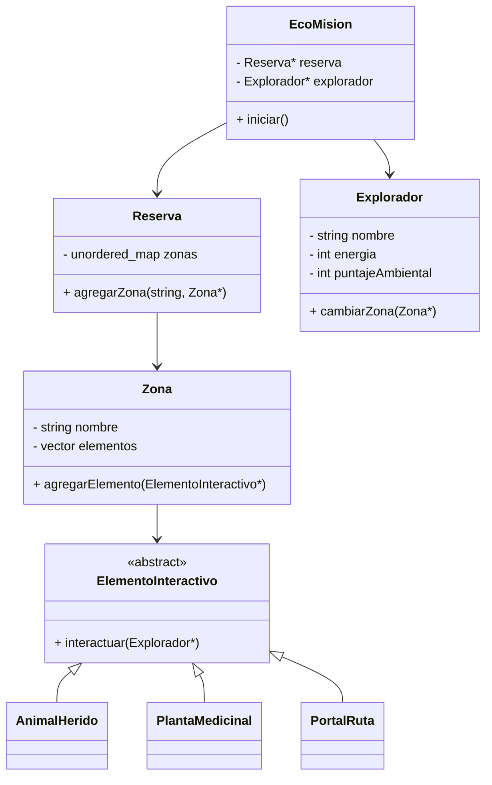
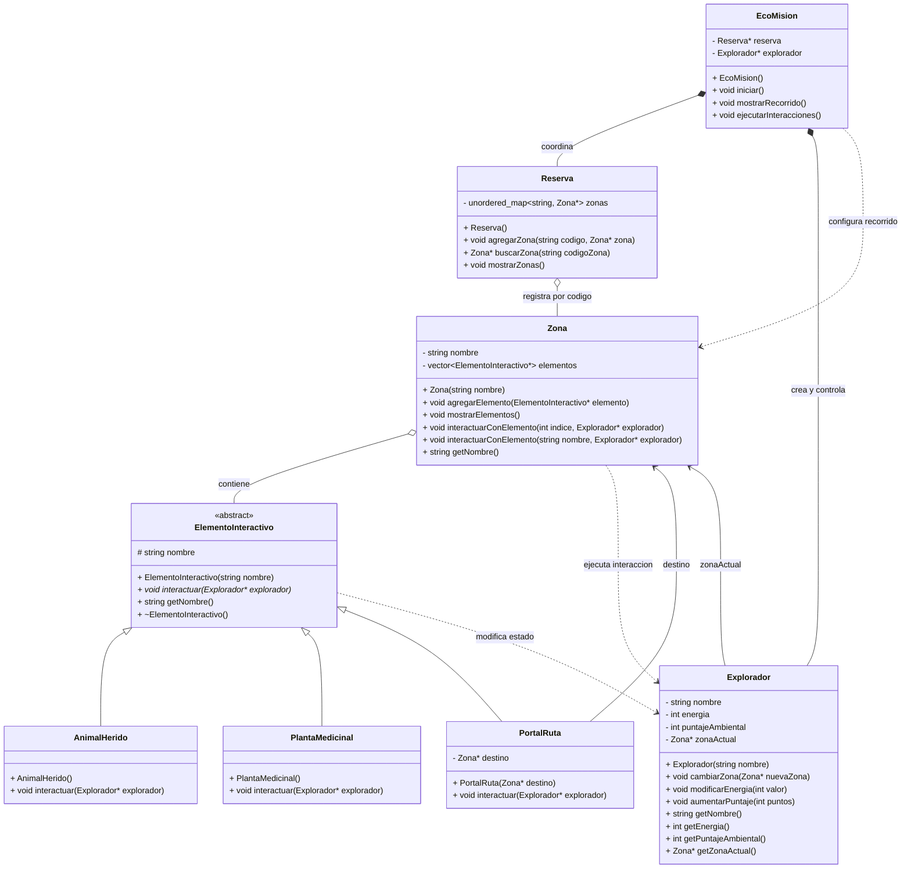

# Inicial

# Intermedio

# Final

----------------------------------------------------------------------------------------

# Matriz de decisiones de diseño

| Decisión | Alternativas consideradas | Decisión final | Justificación | Riesgo si se modela mal |
|---|---|---|---|---|
| Cómo coordinar el funcionamiento general del prototipo | Ejecutar toda la lógica desde `main.cpp`, repartir la lógica entre varias clases o crear una clase coordinadora | Crear la clase `EcoMision` como coordinadora principal | Permite que `main.cpp` sea pequeño y que la creación del explorador, las zonas y las interacciones se manejen desde un solo punto. Así el programa queda más organizado y fácil de probar. | El `main.cpp` podría quedar con demasiada lógica mezclada y sería más difícil entender o modificar el programa. |
| Cómo almacenar las zonas de la reserva | `vector`, lista, arreglo o `unordered_map` | `unordered_map<string, Zona*>` dentro de `Reserva` | Las zonas se identifican por códigos, por ejemplo `"pantano"` o `"bosque"`. Con `unordered_map` se puede relacionar directamente un código con la zona correspondiente y buscarla sin recorrer toda una colección. | Se podrían mezclar los nombres con las posiciones de un vector o hacer búsquedas más enredadas cuando aumenten las zonas. |
| Cómo representar los diferentes elementos del entorno | Crear clases sin relación entre ellas, utilizar una sola clase con muchos condicionales o utilizar herencia desde una clase abstracta | Crear la clase abstracta `ElementoInteractivo` y derivar `AnimalHerido`, `PlantaMedicinal` y `PortalRuta` | Todos los elementos comparten la idea de poder interactuar con el explorador, pero cada uno responde diferente. La clase abstracta permite definir esa base común y que cada elemento implemente su propio comportamiento. | Se repetiría código o se terminaría usando una clase muy grande con muchos `if`, haciendo más difícil agregar nuevos elementos. |
| Cómo almacenar diferentes elementos dentro de una zona | Tener un vector por cada tipo de elemento, guardar solo un tipo de elemento o utilizar un vector de la clase padre | `vector<ElementoInteractivo*> elementos` dentro de `Zona` | Una misma zona puede contener un animal herido, una planta medicinal y un portal. Al almacenarlos como punteros de `ElementoInteractivo`, todos caben en la misma colección aunque su comportamiento sea diferente. | La zona quedaría rígida, obligando a crear colecciones separadas o impidiendo manejar distintos tipos de elementos juntos. |
| Cómo ejecutar las interacciones de los elementos | Usar condicionales para preguntar qué tipo de elemento es, ejecutar acciones desde `Zona` o utilizar polimorfismo | Utilizar el método virtual `interactuar(Explorador* explorador)` sobrescrito en cada clase derivada | `Zona` solo solicita la interacción, pero cada objeto sabe qué debe hacer: `AnimalHerido` modifica energía y puntaje, `PlantaMedicinal` recupera energía y `PortalRuta` cambia la zona actual. Esto muestra polimorfismo de forma clara. | Habría muchos condicionales y cada vez que se agregue un elemento nuevo tocaría modificar la lógica de interacción principal. |
| Cómo relacionar al explorador con la zona donde se encuentra | Guardar solo el nombre de la zona, copiar un objeto `Zona` completo o utilizar un puntero a la zona actual | `Zona* zonaActual` dentro de `Explorador` | El explorador necesita saber en qué zona está y poder cambiar dinámicamente durante el recorrido. Con un puntero puede pasar del pantano al bosque sin copiar toda la información de la zona. | Podrían existir copias innecesarias de zonas o inconsistencias entre la zona real y la que cree tener el explorador. |
| Cómo representar el cambio de zona mediante un portal | Cambiar de zona desde `EcoMision`, guardar solamente el nombre del destino o hacer que el portal conozca la zona destino | `Zona* destino` dentro de `PortalRuta` | El portal es el elemento encargado de mover al explorador. Por eso tiene sentido que conozca directamente cuál es la zona hacia la que conduce y que, al interactuar, llame a `cambiarZona(destino)`. | La lógica del portal quedaría repartida en otras clases y sería más difícil saber qué zona corresponde a cada ruta. |
| Cómo permitir que el explorador interactúe con un elemento de la zona | Interactuar únicamente por posición, únicamente por nombre o ofrecer las dos opciones | Sobrecargar `interactuarConElemento()` en `Zona`: una versión recibe `int indice` y otra recibe `string nombre` | La interacción por índice sirve para una demostración sencilla en consola, mientras que la interacción por nombre hace el diseño más flexible. Además, esta decisión evidencia la sobrecarga solicitada en el proyecto. | El sistema tendría una sola forma rígida de buscar elementos o no cumpliría claramente con el requisito de sobrecarga. |
| Cómo modificar la energía y el puntaje del explorador | Cambiar directamente sus atributos desde otras clases o utilizar métodos públicos controlados | Usar `modificarEnergia(int valor)` y `aumentarPuntaje(int puntos)` en `Explorador` | Los elementos interactivos no acceden directamente a los atributos privados del explorador, sino que le envían mensajes mediante métodos. Esto mantiene el encapsulamiento y permite controlar mejor los cambios de estado. | Se rompería el encapsulamiento y cualquier clase podría alterar energía o puntaje sin control. |
| Cómo mostrar el estado actual del recorrido | Imprimir información desde cada elemento por separado o centralizar la visualización | Utilizar `mostrarRecorrido()` en `EcoMision` y métodos de consulta del `Explorador` | Después de las interacciones, `EcoMision` puede mostrar nombre, energía, puntaje ambiental, zona actual y elementos disponibles. Esto facilita demostrar que el programa sí produjo cambios en el estado del explorador. | La información podría mostrarse incompleta o repartida en varias clases, dificultando comprobar el resultado de las interacciones. |

