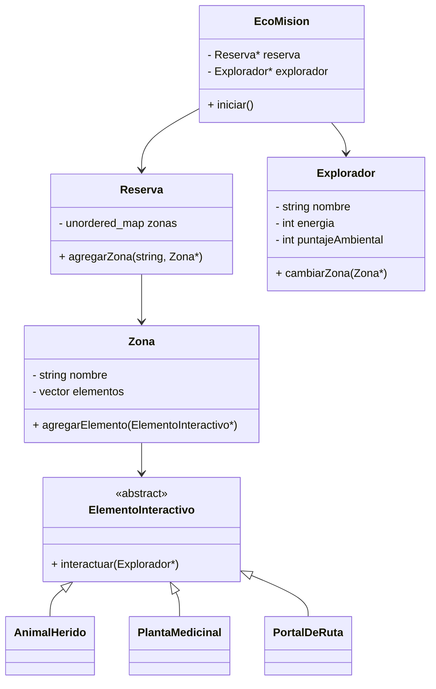

```mermaid
classDiagram 

    class EcoMision {
        - Reserva* reserva
        - Explorador* explorador
        + iniciar()
    }

    class Reserva {
        - unordered_map<string, Zona*> zonas
        + agregarZona(string, Zona*)
    }

    class Zona {
        - string nombre
        - vector<ElementoInteractivo*> elementos
        + agregarElemento(ElementoInteractivo*)
    }

    class Explorador {
        - string nombre
        - int energia
        - int puntajeAmbiental
        + cambiarZona(Zona*)
    }

    class ElementoInteractivo {
        <<abstract>>
        + interactuar(Explorador*)
    }

    ElementoInteractivo <|-- AnimalHerido
    ElementoInteractivo <|-- PlantaMedicinal
    ElementoInteractivo <|-- PortalDeRuta

    EcoMision --> Reserva
    EcoMision --> Explorador
    Reserva --> Zona
    Zona --> ElementoInteractivo
```
